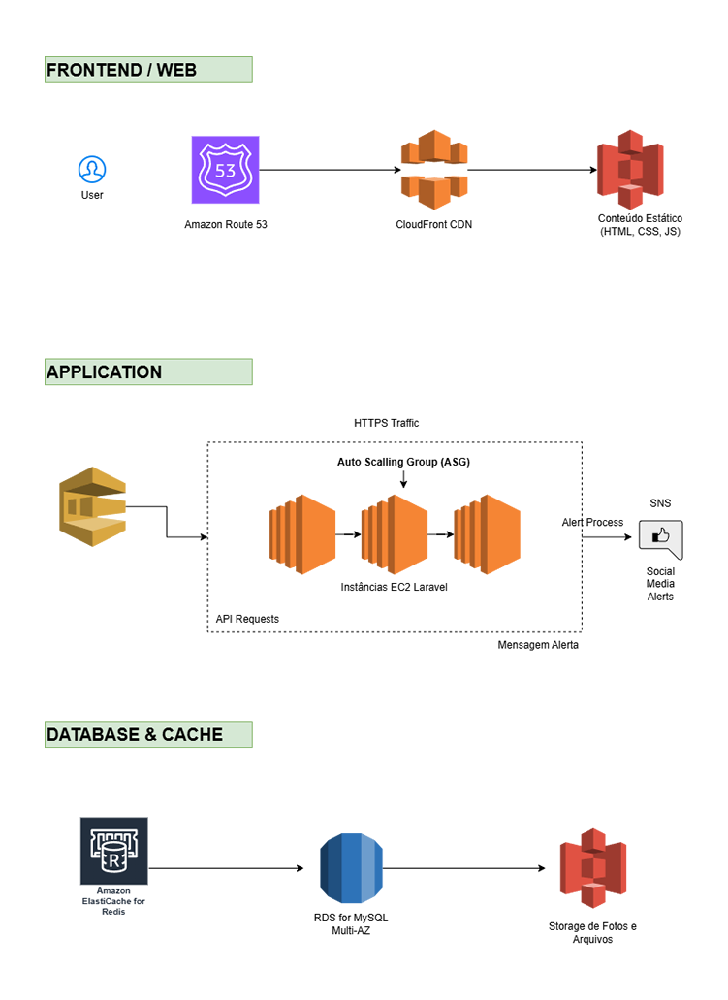

# Desafio: Gerenciando Instâncias EC2 e Otimização de Custo na AWS

## 💡 Ideia da Aplicação: Cadastro Nacional de Animais de Estimação

A aplicação visa criar um **"Cadastro Nacional de Animais de Estimação"**, com os seguintes recursos principais:

* **Base de Dados Pública:** Milhões de registros com características físicas e fotos dos animais.
* **Registro de Perda/Sumiço:** Geração de **alertas automáticos** em redes sociais para casos de desaparecimento.
* **Consulta por Localização:** Permite que o usuário consulte animais desaparecidos em sua área.

* **Tecnologia:** **PHP** (Linguagem-base) com **Laravel** (Framework).
* **Foco:** Projeto **sem fins lucrativos** com ênfase em **menor custo** e **melhor arquitetura AWS**.

---

## 🏗️ Proposta de Arquitetura AWS Otimizada para Custo

A arquitetura proposta adota uma abordagem **Serverless** (onde possível) e **Gerenciada (Managed Services)** para minimizar o esforço operacional e o **Custo Total de Propriedade (TCO)**.

### 1. Camada de Apresentação (Frontend/Web)

| Serviço AWS | Descrição e Função | Otimização de Custo |
| :--- | :--- | :--- |
| **Amazon S3** | **Hospedagem de conteúdo estático** (HTML, CSS, JS). | **Custo baixo** (pague pelo armazenamento e transfer). |
| **Amazon CloudFront** | **Rede de Entrega de Conteúdo (CDN)**. | Melhora o desempenho e **reduz a carga** sobre o backend. |
| **Route 53** | **Serviço de DNS**. | Gerenciamento do domínio e roteamento de tráfego. |

---

### 2. Camada de Aplicação (Backend PHP/Laravel)

| Serviço AWS | Descrição e Função | Otimização de Custo/Performance |
| :--- | :--- | :--- |
| **Amazon EC2 (Linux)** | **Core da aplicação** (PHP/Laravel). | Usar famílias otimizadas como **t3** ou **t4g** (Burst e baixo custo). |
| **Application Load Balancer (ALB)** | **Distribuição de tráfego**. | Essencial para **alta disponibilidade** e distribuição uniforme da carga. |
| **Auto Scaling Group (ASG)** | **Gerenciamento de escalabilidade**. | Garante que novas instâncias sejam geradas em picos e **finalizadas** em baixa, **otimizando o custo**. |
| **Amazon Machine Image (AMI)** | **Imagem customizada com Laravel** (via Packer ou EC2). | Reduz o tempo de inicialização do ASG e garante a consistência do ambiente. |

---

### 3. Camada de Banco de Dados e Cache

| Serviço AWS | Descrição e Função | Estratégia de Custo |
| :--- | :--- | :--- |
| **Amazon RDS for MySQL (Multi-AZ)** | **Base de dados Relacional principal**. | **Multi-AZ** garante **alta disponibilidade** e resiliência. |
| **Dica Sênior - Custo RDS:** Começar com instâncias menores (**db.t3** ou **db.m6g**) e considerar **Reserved Instances (RIs)** para projetos de longo prazo (**economia de até 70%**). |
| **Amazon S3** | **Armazenamento de Arquivos** (Fotos dos Animais). | Armazenamento **mais barato** e infinitamente **escalável** para objetos (fotos). |
| **Amazon ElastiCache (Redis)** | **Cache para o Laravel** (sessões e consultas). | **Reduz a carga** de leitura do RDS, diminuindo a necessidade de instâncias RDS maiores. |

---

### 4. Recursos de Processamento e Alertas

| Serviço AWS | Descrição e Função | Otimização de Custo/Recurso |
| :--- | :--- | :--- |
| **Amazon SQS (Simple Queue Service)** | **Fila para processamento assíncrono**. | Desacoplamento e confiabilidade no processamento de alertas. |
| **Amazon EC2 (Instância Worker)** | **Processador de filas Laravel (Queue Worker)**. | Uma **pequena instância dedicada** (ex: **t3.nano** ou **t3.micro**) rodando o Worker para processar o SQS de forma contínua e previsível. **Substitui o Lambda** para o Worker do Laravel. |
| **Amazon SNS (Simple Notification Service)** | **Serviço de Mensagens para Alertas** (para redes sociais). | O Worker envia a notificação para o SNS, que distribui. É **custo-efetivo** e **escalável**. |

---

## 📐 Diagrama de Arquitetura (Draw.io)

Esta arquitetura é um exemplo clássico de **Arquitetura de 3 Camadas** (Frontend, Aplicação, Dados) com componentes de escalabilidade.

### Detalhamento do Fluxo

1.  **Acesso:** O usuário inicia a conexão via **Route 53** $\rightarrow$ **CloudFront (CDN)** $\rightarrow$ **ALB**.
2.  **Escalabilidade Web:** O **ALB** distribui o tráfego para as instâncias **EC2** no **ASG**. O ASG lança ou finaliza instâncias automaticamente conforme o tráfego, garantindo **otimização de custos**.
3.  **Dados:** A aplicação (EC2) usa o **ElastiCache** para leituras rápidas e o **RDS for MySQL (Multi-AZ)** para transações e dados estruturados. As fotos dos animais são salvas/lidas do **S3**.
4.  **Alerta Assíncrono:** Ao registrar a perda, a aplicação envia uma mensagem para o **SQS** (desacoplando a operação).
5.  **Processamento:** A **EC2 Worker Instance** lê a mensagem do SQS, executa a lógica de geolocalização e alerta, e envia a notificação final para o **SNS** (que fará a integração com as redes sociais).

---

Esta estrutura atende perfeitamente ao requisito de usar EC2 de forma otimizada, é **altamente disponível** (Multi-AZ, ALB, ASG) e possui estratégias claras de **otimização de custos**.
